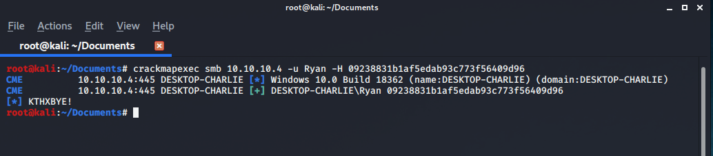
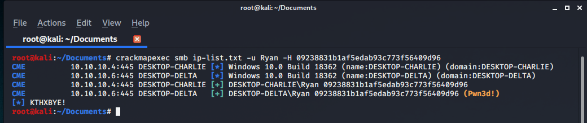
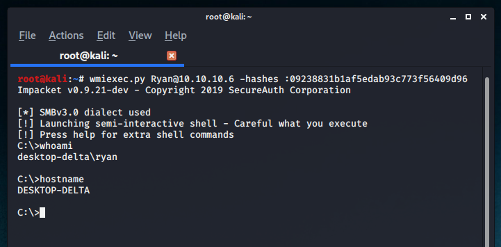

# Password Cracking lab

## Use hashid to find the possible hash types of the following hashes
### a. b89eaac7e61417341b710b727768294d0e6a277b
```
[+] SHA-1 [Hashcat Mode: 100]
[+] Double SHA-1 [Hashcat Mode: 4500]
[+] RIPEMD-160 [Hashcat Mode: 6000]
[+] Haval-160 
[+] Tiger-160 
[+] HAS-160 
[+] LinkedIn [Hashcat Mode: 190]
[+] Skein-256(160) 
[+] Skein-512(160) 
```

### b. 7196759210defdc0
```
[+] MySQL323 [Hashcat Mode: 200]
[+] DES(Oracle) [Hashcat Mode: 3100]
[+] Half MD5 [Hashcat Mode: 5100]
[+] Oracle 7-10g [Hashcat Mode: 3100]
[+] FNV-164 
[+] CRC-64 
[+] Cisco-PIX(MD5) [Hashcat Mode: 2400]
[+] Cisco-ASA(MD5) [Hashcat Mode: 2410]
```
### c. b4b9b02e6f09a9bd760f388b67351e2b
```
[+] MD2 
[+] MD5 [Hashcat Mode: 0]
[+] MD4 [Hashcat Mode: 900]
[+] Double MD5 [Hashcat Mode: 2600]
[+] LM [Hashcat Mode: 3000]
[+] RIPEMD-128 
[+] Haval-128 
[+] Tiger-128 
[+] Skein-256(128) 
[+] Skein-512(128) 
[+] Lotus Notes/Domino 5 [Hashcat Mode: 8600]
[+] Skype [Hashcat Mode: 23]
[+] Snefru-128 
[+] NTLM [Hashcat Mode: 1000]
[+] Domain Cached Credentials [Hashcat Mode: 1100]
[+] Domain Cached Credentials 2 [Hashcat Mode: 2100]
[+] DNSSEC(NSEC3) [Hashcat Mode: 8300]
[+] RAdmin v2.x [Hashcat Mode: 9900]
```
### d. $H$984478476IagS59wHZvyQMArzfx58u. 
```
[+] Juniper Netscreen/SSG(ScreenOS) [Hashcat Mode: 22]
```
### e. 82a9dda829eb7f8ffe9fbe49e45d47d2dad9664fbb7adf72492e3c81ebd3e29134d9bc12212bf83c6840f10e8246b9db54a4859b7ccd0123d86e5872c1e5082f
```
[+] SHA-512 [Hashcat Mode: 1700]
[+] Whirlpool [Hashcat Mode: 6100]
[+] Salsa10 
[+] Salsa20 
[+] SHA3-512 
[+] Skein-512 
[+] Skein-1024(512) 

```

## Question 2
### Charsets
```
first three characters are lowercase,fourth is uppercase and fifth is a number
Hash : 4322a6b771e1b312ceb084adeb68e512
[+] MD2 
[+] MD5 [Hashcat Mode: 0]
[+] MD4 [Hashcat Mode: 900]
[+] Double MD5 [Hashcat Mode: 2600]
[+] LM [Hashcat Mode: 3000]
[+] RIPEMD-128 
[+] Haval-128 
[+] Tiger-128 
[+] Skein-256(128) 
[+] Skein-512(128) 
[+] Lotus Notes/Domino 5 [Hashcat Mode: 8600]
[+] Skype [Hashcat Mode: 23]
[+] Snefru-128 
[+] NTLM [Hashcat Mode: 1000]
[+] Domain Cached Credentials [Hashcat Mode: 1100]
[+] Domain Cached Credentials 2 [Hashcat Mode: 2100]
[+] DNSSEC(NSEC3) [Hashcat Mode: 8300]
[+] RAdmin v2.x [Hashcat Mode: 9900]


hashcat -a 3 -m 0 hash.txt ?l?l?l?u?d --status --force

4322a6b771e1b312ceb084adeb68e512:hhgR8           
Session..........: hashcat                       
Status...........: Cracked
Hash.Type........: MD5
Hash.Target......: 4322a6b771e1b312ceb084adeb68e512
Time.Started.....: Thu Dec  2 16:42:08 2021 (0 secs)
Time.Estimated...: Thu Dec  2 16:42:08 2021 (0 secs)
Guess.Mask.......: ?l?l?l?u?d [5]
Guess.Queue......: 1/1 (100.00%)
Speed.#2.........:  1623.5 MH/s (1.42ms) @ Accel:128 Loops:26 Thr:256 Vec:1
Recovered........: 1/1 (100.00%) Digests, 1/1 (100.00%) Salts
Progress.........: 4569760/4569760 (100.00%)
Rejected.........: 0/4569760 (0.00%)
Restore.Point....: 0/175760 (0.00%)
Restore.Sub.#2...: Salt:0 Amplifier:0-26 Iteration:0-26
Candidates.#2....: sarA1 -> xqxV7
Hardware.Mon.#2..: Temp: 36c Fan: 16% Core:1306MHz Mem:1000MHz Bus:0
Started: Thu Dec  2 16:42:03 2021
Stopped: Thu Dec  2 16:42:09 2021


Obtained password is hhgR8
```


## Questions 3
### Straight
```
This mode cracks a hash by comparing the hash with a list of words in the provided wordlist
```
### Combination
```
This mode allows to append each word contained in a wordlist to the end of each word container in a second wordlist
```
### Brute-force
```
This type of attack consists of massive character combination tries until the hash is cracked
```
### Hybrid wordlist + Mask
```
A Hybrid attack mode allows combining a dictionary attack then a brute force attack. By using this mode, you can prepend wordlist elements to a bruteforce attack
```
### Hybrid Mask + Wordlist
```
A Hybrid attack mode allows combining a brute force attack then a dictionary attack. By using this mode, you can append wordlist elements to a bruteforce attack
```


## Questions 4
### What are rainbow tables?
```
A rainbow table is a list of many strings or plaintext password hashes that have already been calculated and stored. Authentication is  based on password hashes rather than plaintext passwords themselves, so rainbow tables allow hackers to  access without knowing the original password.
```

### How is it possible to speed up cracking of hashes by using them?
```
Rainbow tables are fast and effective at cracking passwords because each password is hashed the same way. For example, if a hacker has a rainbow table with the hash for the password “johnny12,” any user that uses that password will have the same hash, so that password can easily be cracked.
A rainbow table associates plaintext possibilities with each of those hashes, which the attacker can then exploit to gain access as an authenticated user. Rainbow tables make password cracking much faster than earlier methods, such as brute-force cracking and dictionary attacks.
This is because there is no need to crack the hashes since the rainbow table contains pre-computed table of hash values that are pre-matched to possible plain text passwords.
```

### Password salting is a best practice that can counter rainbow table cracking.Explain what password salting is and why it counters rainbow tables
```
A salt is random data that is used as an additional input to a one-way function that hashes data, a password or passphrase.
Salts are used to safeguard passwords in storage. 
The idea with the salt is to make it much harder to guess with brute-force than a normal character-based password. Rainbow tables are often built with a special character set in mind, and don't always include all possible combinations (though they can).
Historically, only a cryptographic hash function of the password was stored on a system, but over time, additional safeguards were developed to protect against duplicate or common passwords being identifiable (as their hashes are identical).Salting is one such protection.

```


### Question 5
### Explain how pass the hash is possible and how it can be executed
```
A pass the hash attack  is a hacking technique that allows an attacker to authenticate to a remote server or service by using the underlying NTLM or LanMan hash of a user's password.
The threat actor doesn’t need to decrypt the hash to obtain a plain text password.  Pass the Hash attacks exploit the authentication protocol, as the passwords hash remains static for every session until the password is rotated.It achieves this by exploiting an implementation weakness in the authentication protocal. 
Pass the Hash attacks are mostly prevalent of windows machines.On systems or services using NTLM authentication, users' passwords are never sent in cleartext over the wire. Instead, they are provided to the requesting system, like a domain controller, as a hash in a response to a challenge–response authentication scheme.Research on the Native Windows applications and APIs used in some remote connections has shown that a cleartext password may not be required to complete network authentication successfully, only the hashes are needed.
```

### How it can be executed (Passing the hash using CrackMapExec)

To execute a pass the hash attack,one must first have a password hash to pass through the network.Hashes can be dumped using tools such as mimikatz
<br/>
In this example we have a user Ryan whose hash we have
<br/>
We can try to authenticate to another machine in the network using his hash using the following command `crackmapexec smb 10.10.10.4 -u Ryan -H 09238831b1af5edab93c773f56409d96`


<br/>
<br/>
<br/>


We can also try to authenticate to other machines in the network using Ryan's hash by using a list of ip address.
<br/>Below is an example using the following command
<br/>`crackmapexec smb ip-list.txt -u Ryan -H 09238831b1af5edab93c773f56409d96`


You can see we were able to find one machine which we can gain access using the hash.
<br/>
<br/>
<br/>


we can obtain a shell on this machine from our attacker machine using some tools such as psexec and wmiexec which allow us to pass the hash and obtain a shell
<br/>From here you can notice the wmiexec help menu and you can see that it asks for LMHASH:NTHASH, but mimikatz only gives us the LM hash.<br/>No need to worry here usually the hash before `:` its an empty hash and doesn't show on mimikatz so it doesn't dump that, so to use wmiexec.py here we can just use the hash in this way `:HASH`
<br/>

<br/>
<br/>

